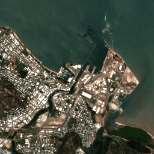
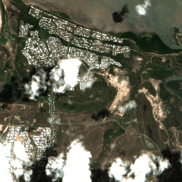
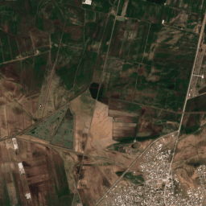
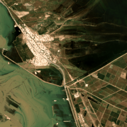

# Sentinel Flooding Sequences Dataset

## What is this dataset about?

This dataset contains multitemporal satellite image patches of ESA's Sentinel satellites for flood event detection. This dataset was initially released as a shared subtask under the [Multimedia Satellite Task 2019](https://github.com/multimediaeval/2019-Multimedia-Satellite-Task) at [MediaEval Benchmark](http://www.multimediaeval.org/). You can find more information in the [dataset paper](https://github.com/multimediaeval/2019-Multimedia-Satellite-Task/blob/master/MediaEval2019_MMSatOverview.pdf).

Participants received a set of sequences of [Sentinel-2 satellite](https://sentinel.esa.int/web/sentinel/missions/sentinel-2) images that depict a certain region over a certain length of time. They are required to create a binary classifier that determines whether or not there was a flooding event ongoing in that region at that time. As this was the first year, that we worked with sequences of satellite images, the data was balanced so that the prior probability of the image sequence depicting a flooding event is about 50%. This design decision allowed us to better understand the task. Challenges of the task include cloud cover, and ground-level changes with non-flood causes.

<div align="center" markdown="1" style="width:100%">
<table style="border-width:0;">
<tbody style="width:100%">
<tr>
<td align="center"> 
 </td>
<td align="center"> 
</td>
<td align="center"> 
 </td>
<td align="center"> 
 </td>
</tr>
</tbody>
</table>
<i>Figure 3. Sample image sequences for different cities from our dataset. The goal of this task is to classifiy image sequences into two classes whether they belong to a flooding event or not.</i>
</div>

## How can I download the dataset? 

You can get the first version of the dataset, that was part of the Multimedia Satellite Task 2019, from here:
* the Development set can be downloaded [here](https://cloud.dfki.de/owncloud/index.php/s/5w9bNHTF7iL2Xze).
* the Test set can be downloaded [here](https://cloud.dfki.de/owncloud/index.php/s/saaoFiZXLxpq7NW).


**Please note:**
We will continuously update the dataset in the future with more recent flooding events, to evaluate the generalizability of the methods to varying events and geographical regions. We also plan to provide additional Ground Truth and other modalities for this dataset.


## What data is included in the dataset?

The dataset consists of 412 satellite sequences that have been extracted for flooding and non-flooding events in 2018/2019. For each image sequence the following information is provided:
* a class label: (see section Ground Truth file for sequences)
* the image bands as timeseries (see section Metadata for sequences)

#### Ground Truth file for sequences
The dataset has been created from past flooding events that have been mapped and validated by human annotators for the emergency response service EMSR. Rather than relying on a single image or a pair of images, we consider a sequence of images. The label is created based on the intersection of the mapped flood extend (overlap with image sequence=1, no overlap=0). For each sequence we provide the corresponding label to participants in a json-lines file **dev/testset_sequences_labels.jsonl** with the corresponding keys "sequence_id" and "label". 

#### Metadata for sequences
Each image sequence is stored in one specific folder that contains images and a **timeseries.txt**. The timeseries.txt contains the timesteps for each time series with the following three lines of information: DATE, FLOODING, FULL-DATA-COVERAGE (whether the area is fully covered by the image).

```
Layer_1_DATE: 2018-12-18,
Layer_1_FLOODING: True,
Layer_1_FULL-DATA-COVERAGE: True,
Layer_2_DATE: 2018-12-28,
Layer_2_FLOODING: True,
Layer_2_FULL-DATA-COVERAGE: True,
Layer_3_DATE: 2019-01-02,
Layer_3_FLOODING: False,
Layer_3_FULL-DATA-COVERAGE: True,
...
```

The timesteps are encoded into a tiff file, where the number of channels corresponds to the length of the time-series. Each image band of the Sentinel-2 satellite is stored in the corresponding file (e.g. band 4 is stored in ''B4_series.tif'').
Since we provide Level 2A atmospheric corrected images, the timeseries tiff files contain 12 instead of 13 bands of the Sentinel-2 satellite.
<!--In the following table, we provide an overview of the bands. You can use bands 4,3,2 to create RGB images, but also use other bands to create a False color image or feed more than three bands to your classifier. Please note that the bands have a different spatial resolution and might require upscaling.-->

<!--
## Who are the dataset contributors?
#### Task organizers of the Multimedia Satellite Task 2020
* Benjamin Bischke, German Research Center for Artificial Intelligence (DFKI), Germany (first.last at dfki.de)
* Patrick Helber, German Research Center for Artificial Intelligence (DFKI), Germany (first.last at dfki.de)
* Erkan Basar, Radboud University & FloodTags, Netherlands, 
* Simon Brugman, Radboud University, Netherlands
* Zhengyu Zhao, Radboud University, Netherlands
* Konstantin Pogorelov, Simula Research Laboratory, Norway
#### Task auxiliaries of the Multimedia Satellite Task 2020
* Martha Larson, Radboud University, Netherlands
* Jens de Bruijn, Floodtags, Netherlands
* Tom Brouwer, Floodtags, Netherlands
* Nicolas Ventulett, Vision Impulse, Germany
--> 

## How can I cite the work?

Please cite us with the following bibtex, if you use this dataset in your work or research:
```
@inproceedings{bischke_2019_ceurws_mmsat19, 
	title = {The Multimedia Satellite Task at MediaEval 2019: Emergency Response for Flooding Events}, 
	author = {Bischke, Benjamin and Helber, Patrick and Brugman, Simon and Basar, Erkan and Zhao, Zhengyu and Larson, Martha and            Pogorelov, Konstantin},
	booktitle = {Working Notes Proceedings of the MediaEval 2019 Workshop},
	year = {2019},
	address={Sophia Antipolis, France},
	organization={CEUR-WS},
}
```

If you need help or have any questions please contact Benjamin Bischke (firstname.lastname at dfki.de).

<!--
## Is there a list of related work?
The following authors developed methods to work with the dataset:
* Author 1
* Author 2
* Author 3
* Author 4
* Author 5
* Author 6
-->


